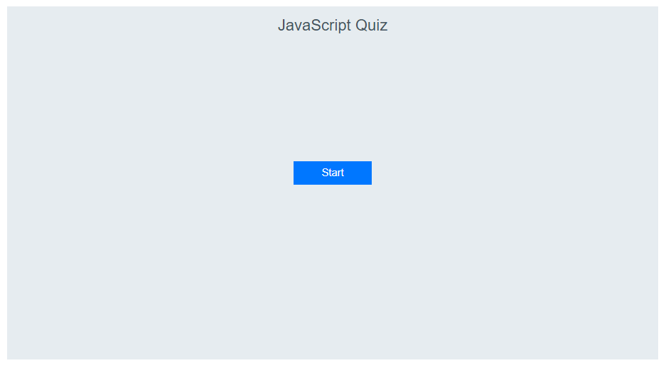
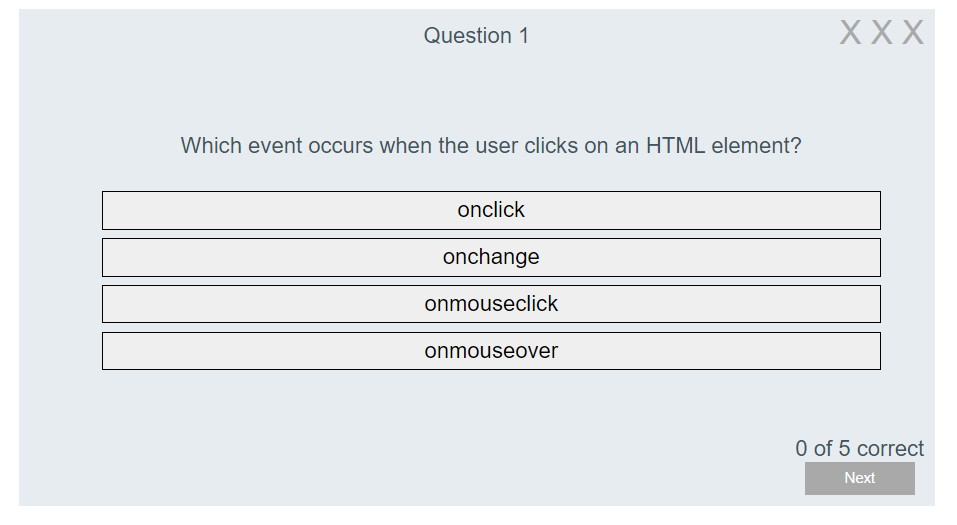
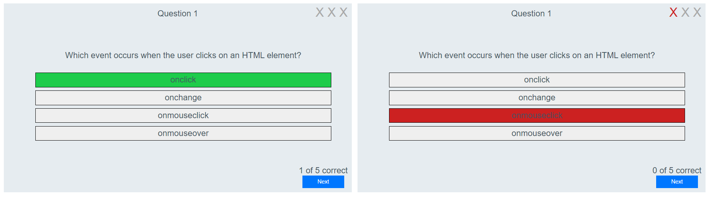
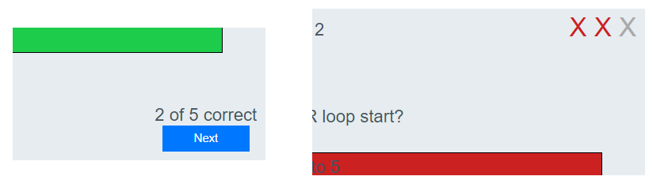
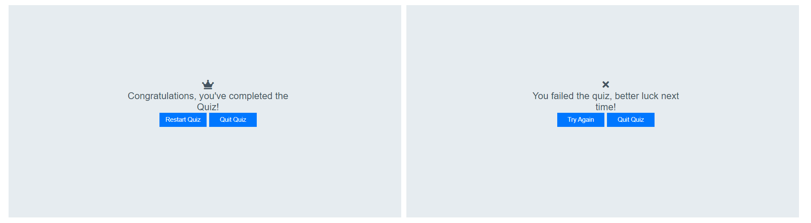

# Javascript quiz

[Link to the live project deployed on Github pages](https://finnahern.github.io/javascript-quiz/)

A quiz about basic concepts and functions in Javascript to test the user's new knowledge or for Javascrpt veterans to brush up a bit. The user is asked a series of questions, selected from an array of 12 possiblities in a random order. The user must answer 5 correctly before they get 3 wrong.

## Features

- ### Start Screen
	- The start screen is a simple jumping off point which prompts the user to begin the quiz and provides a place to return to when the user decides to quit.

- ### Question box
	- The question box is where the questions of the quiz are displayed and the user will primarily interact with the HTML elements and JavaScript functions of the page.
	- Here the user can see the current question number at the top of the page as well as their score; how close they are to passing or failing the quiz is displayed in the top and bottom right side corners. The Next button on the bottom right is disabled until the user selects an answer, once they do they can click it to move on to the next question.

- ### User feedback
	- When the user clicks on an answer the program highlights the selected answer in either green or red to let the user know if they got it right or wrong. The remaining answer buttons are disabled so the user can't keep trying until they get it right and the Next button is enabled so the user can move on to the next question when they're ready.

- ### Score counts
	- The score counts at the top and bottom right corners let the user know how they're doing. The correct answer count is a simple number and the incorrect count is shown as three Xs that turn red when the user gets an answer wrong. Three strikes and you're out.

- ### Results box
	- When the user gets either five questions right or three wrong they are taken to the results screen, informing them that they have either passed or failed the quiz and giving them the options to restart the quiz or quit and go back to the start screen.

- ### Future features to be implemented
	- A timer on the quiz to let the user know how long they're taking. It could also be used as a time limit for each question.
	- Adapt the code to work with questions that have more or fewer possible answers. Right now it only works with 4 so I wasn't able to include true/false questions.
	- A feature to randomise the order the multiple choices appear in to make it harder to solve the quiz through trial and error. Right now the answers always appear in the same order.

## Deployment

The site was developed using the Gitpod IDE and deployed using Github pages. [The Gitpod Chrome plugin](https://chrome.google.com/webstore/detail/gitpod-dev-environments-i/dodmmooeoklaejobgleioelladacbeki) was also used for easy access to the repository and the development enviornment.

## Testing

The was tested throughout development using the Chrome, Firefox and Edge web browsers on a desktop PC running the Windows 10 OS, the Chrome browser for Android on a OnePlus 6 phone, the iOS Safari browser on an iPhone 8 as well as a variety of simulated mobile devices and screen sizes using the Chrome developer tools.

### Bugs identified and fixed:
- The compareAnswer function was being called multiple times when the user clicked on an answer button. This was caused by the loop to add event listeners to the mutiple choice answers was in the pullQuestion function meaning that a new set of event listeners were added to the buttons every time the pullQuestion function was called. This was a simple fix to move the loop outside the pullQuestion function to the global scope.
- The incorrectCount variable was not resetting properly meaning that after the first failed attempt incorrectCount would always be greater than or equal to 3 so any wrong answers would fail the quiz. I solved this by declaring the variable in the global scope and passing it as an argument to the incrementIncorrectCount function.
- There was a typo in the answer to question 5 in the array on line 324 meaning it didn't match any of the options in the compareAnswers function and would always be read as incorrect by the compareAnswer function even if the user selected the right answer.
- The question-number span at the top of the quiz-box div wasn't resetting properly when the user restarted the quiz. I edited the statement on line 68 in intialiseQuiz to reset the number. I also removed the abortQuiz function which was to be called when the user clicked the Quit button and instead used location.reload() to completely reset the page.
- The result-box would continue to show failure text if the user fails the quiz, retries it and gets it right the second time. This was because the failQuiz function changes the contents of the HTML elements, but passQuiz wasn't changing them back. This was fixed by adding statements to the passQuiz function to edit the DOM elements back to their default values.

### Validator testing
- #### HTML
	- No errors were returned when passing through the [W3C validator](https://validator.w3.org/nu/?doc=https%3A%2F%2Ffinnahern.github.io%2Fjavascript-quiz%2F)
- #### CSS
	- No errors were found when passing through the [Jigsaw validator](https://jigsaw.w3.org/css-validator/validator?uri=https%3A%2F%2Ffinnahern.github.io%2Fjavascript-quiz%2F&profile=css3svg&usermedium=all&warning=1&vextwarning=&lang=en)
- #### JavaScript
	- No errors were found when passing through the official [Jshint validator](https://jshint.com/)
		- The following metrics were returned:
		- There are 13 functions in this file.
		- The function with the largest signature take 1 arguments, while the median is 0.
		- The largest function has 17 statements in it, while the median is 7.
		- The most complex function has a cyclomatic complexity value of 6 while the median is 2.

### Improvements to make
To my knowledge there are no outstanding bugs or errors in the code, however there are always improvements or optimisations that can be made. Right now the enableOptions, disableOptions and resetColour functions and the switch statement the change the colour of the Xs in the top right are clunky and inelegant. Some sort of loop to apply attributes/style rules to each option would be neater and more efficient. Right now each of these functions consist of 4 nearly identical lines of code which are functional but can be improved.

## Credits

### Acknowledgements

Spencer Barriball for his invaluable feedback and advice.

David Malone for his support and encouragement.

### Technology used

- HTML
- CSS
- JavaScript
- [Font Awesome](https://fontawesome.com/) - Resource used to import icons for footer.
- [Git](https://git-scm.com/) - Version control.
- [Github](https://github.com/) - Used to host repository and live site.
- [Gitpod IDE](https://gitpod.io/) - Development enviornment used to build site.
- [Chrome developer tools](https://developer.chrome.com/docs/devtools/) - Tools to test and preview site throughout development.
- [W3C Validator](https://validator.w3.org/) - Used to validate code and check for errors.

### Resources

- [W3Schools](https://www.w3schools.com/)

### Text credits

- Quiz questions sourced from the [W3Schools JavaScript quiz](https://www.w3schools.com/quiztest/quiztest.asp?qtest=JS)